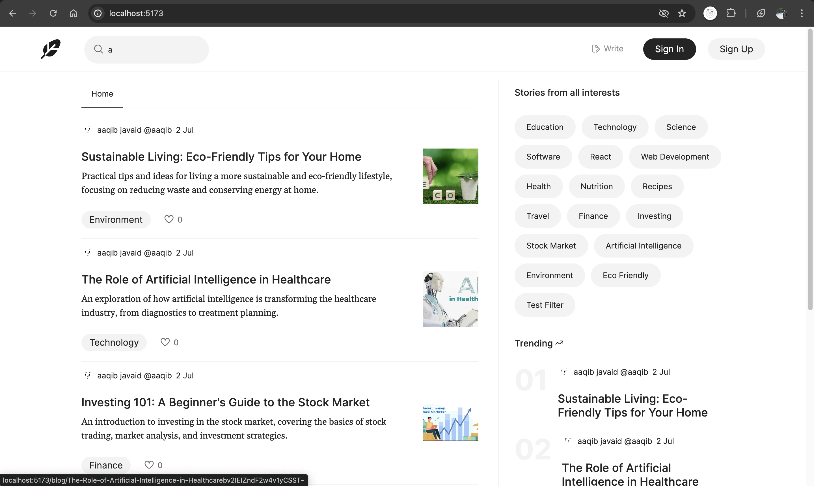

# Blog App

> Blogging platform built with the MERN stack & Redux.



## Features

- Full featured blogging editor
- Blog reviews and ratings
- Trending products sidebar
- Blog pagination
- Blog search feature
- User profile with blogs
- User Blog details page
- Like, comment etc on blogs
- Login / Logout functionality

## Env Variables

### Client

Create a .env file in client folder and add the following:

```
VITE_SERVER_DOMAIN = http://localhost:3000

VITE_FIREBASE_API_KEY = your firebase API key

VITE_FIREBASE_MESSAGING_SENDER_ID = your firebase sender id

VITE_FIREBASE_APP_ID = your firebase app id
```

### Server

Create a .env file in server folder and add the following:

```
PORT = 3000

MONGO_URI = your mongo URI

JWT_SECRET = add anything you want

AWS_ACCESS_KEY_ID = your AWS access key id

AWS_SECRET_ACCESS_KEY = your AWS secret access key

AWS_SDK_JS_SUPPRESS_MAINTENANCE_MODE_MESSAGE = '1'
```

## Install Dependencies (frontend & backend)

```
cd client
npm install

cd server
npm install
```

## Run

```
# Run frontend (:5173)
npm run dev

# Run backend (:3000)
npm run start
```

## Sample User Login

```
aaqib@email.com
123456Aa
```

## License

Copyright (c) 2024 Aaqib Javaid
